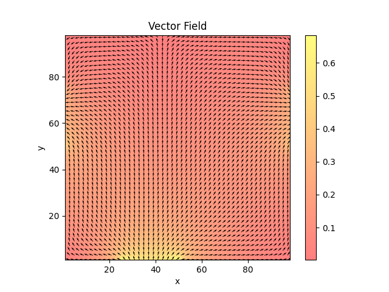

# Jacobi Iteration for the Laplace Equation

This project implements the **Jacobi iteration method** to solve the **Laplace equation** over a two-dimensional grid. It models **incompressible and irrotational flow** using the **stream function formulation**.

## Mathematical Background

For a 2D, incompressible, and irrotational fluid, the stream function $\phi(x, y)$ satisfies the Laplace equation:

```math
\frac{\partial^2 \phi}{\partial x^2} + \frac{\partial^2 \phi}{\partial y^2} = 0 \ .
````

The velocity field is derived from the stream function:

```math
v_x = \frac{\partial \phi}{\partial y}, \ \ v_y = -\frac{\partial \phi}{\partial x} \ .
```

Using finite differences, the Laplace equation can be solved iteratively based on an initial matrix storing $\phi(x, y)_{\text{init}}$.  

The boundary values of this matrix define the boundary conditions of the flow, such as the velocity of the incoming and outgoing flow in a cavity. The resulting solution represents the flow behavior inside the cavity.

## How to Use

### 1. Initialize the Initial Grid (with a default value for each entry) like this:

```cpp
flow::matrix<T> init{x_dim, y_dim, static_cast<T>(0)};
```
- `x_dim` and `y_dim` specify the dimensions of the matrix.
- The third argument sets the default value for all entries during initialization.

### 2. Create and Solve the Flow:  

This initial matrix (especially the boundary conditions) defines a flow. This flow is initialized like:
```cpp
flow<T> flow::psi {std::move(init), max_iter};
psi.solve(nthreads);
psi.save(output_filename);
```
- `max_iter` Number of Jacobi iterations
- `nthreads` Number of threads used in OpenMP/MPI mode
- `output_filename` Name of the output file where velocity data will be stored
- Output is a binary file with lines: `x y x_velocity y_velocity`


## Parallelization
Headers for CUDA, MPI+OpenMP, and OpenMP versions are available.

Each header contains a specific implementation of the `flow` class and solves the Laplace equation in parallel, based on the available system.

## Example 

A complete example demonstrating the solver on a square cavity for a certain initial matrix is provided in:

- main.cpp (MPI+OMP) 
- main.cu (CUDA)

The simulation writes its output to velocities_out.dat with the following column format:

```cpp
x    y    vx    vy
````

Each line contains a grid point and its computed velocity components. 
You can visualize the results using the plotting script `plot_vectorfield.py`

```bash
python3 plot_vectorfield.py velocities_out.dat x_dimension y_dimension precision
```
- `x_dimension`: size of the grid in x direction
- `y_dimension`: size of the grid in y direction
- `precision`: either `"float"` or `"double"`, depending on the data type used in the simulation



### Build and Run
You can build and run different versions depending on your system capabilities.
#### Using OMP
Compile manually, using OMP:

```bash
g++ -Wall -std=c++20 -O3 -march=native -fopenmp -I../include -o main_omp main.cpp
```
Add `-DUSE_DOUBLE` to enable double precision.

and run with:

```bash 
./main_omp -x_dim 100 -y_dim 100 -nthreads 8
```

- `-x_dim` sets the grid size in x dimension (default = 100)
- `-y_dim` sets the grid size in y dimension (default = 100)
- `-nthreads` sets the number of threads used (default = 1)

#### Using MPI + OMP
For using MPI + OMP, compile with:

```bash
mpic++ -DMPI_FOUND -Wall -std=c++20 -O3 -march=native -fopenmp -I../include -o main_mpi main.cpp
```
Add `-DUSE_DOUBLE` to enable double precision.

and run with:

```bash 
mpirun -np 4 ./main_mpi -x_dim 100 -y_dim 100 -nthreads 8
```

- `-np`sets the number of mpi processes
- `-x_dim` sets the grid size in x dimension (default = 100)
- `-y_dim` sets the grid size in y dimension (default = 100)
- `-nthreads` sets the number of threads used (default = 1)
- add `--hostfile hostfile` to run on serveral machines

#### Using CUDA
For using CUDA, you can compile the example using:
```bash
nvcc -Xcompiler="-std=c++20 -O3 -march=native" -std=c++20 -O3 -arch=sm_75 -I../include -o main_cuda main.cu
```
Add `-DUSE_DOUBLE` to enable double precision.

:warning: change `-arch=` to your system!

:warning: only works for square problems right now!

and run with:

```bash 
./main_cuda -x_dim 100 -y_dim 100
```

- `-x_dim` sets the grid size in x dimension (default = 100)
- `-y_dim` sets the grid size in y dimension (default = 100)

#### Using meson
If you are using meson, you can compile any version with: 

```bash
meson setup builddir
cd builddir
meson compile main_omp
meson compile main_mpi
meson compile main_cuda
```

:warning: For CUDA, make sure the following line is uncommented in meson.build:

```bash
project('Fluid', ['cpp', 'cuda'])  # Enable both C++ and CUDA languages; requires nvcc at configure time
# project('Fluid', 'cpp')          # Enable only C++ language; no CUDA support, no nvcc required
```

:warning: change `-arch=` in meson.build to your system!
